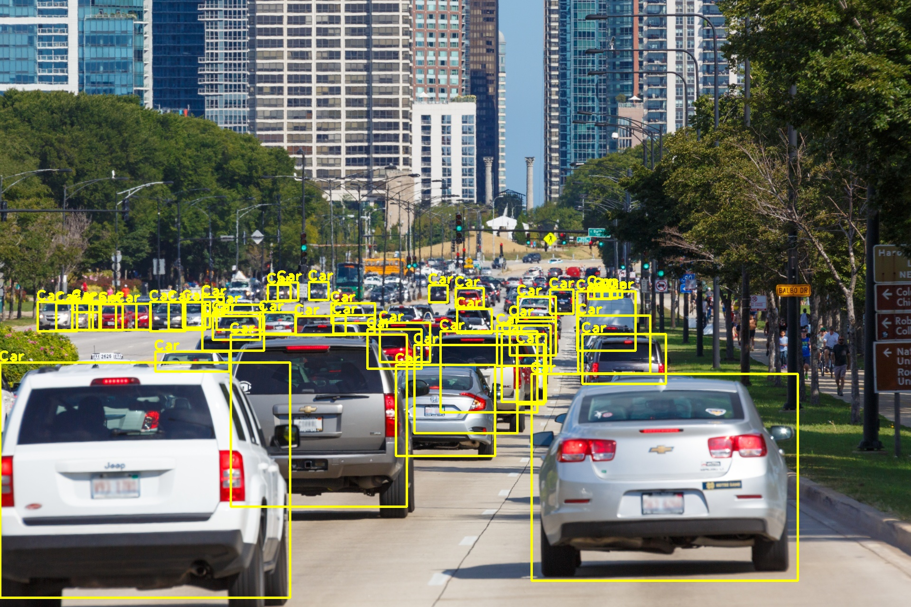

## Simple mmdetection 

Overall goal of this project is to implement most popular, inference only, CPU friendly object detection models from [mmdetection framework](https://github.com/open-mmlab/mmdetection) for research and production use. Currently mmdetection does not support CPU only inference mode ([see here](https://github.com/open-mmlab/mmdetection/issues/1274)), however in real life, production models are rarely deployed on GPU enabled environments. SMD solves this problem.

### Goals

* Create foundation for better understanding and research of CPU-only DNN performance
* All mmdetection pretrained weights can be directly used with SMD ([mmedtecection model ZOO](https://github.com/open-mmlab/mmdetection/blob/master/docs/MODEL_ZOO.md)).
* SMD limits number of dependencies to: torch, torchvision, PIL and numpy
* Wherever possible mmdetection specific code is replaced with torch and torchvision alternatives (transforms, nms etc.)

### Non-goals

* By design this code has no training capabilities at all. Training specific code is either removed or reduced to the bare minimum. For training, finetuning or transfer learning use [mmdetection](https://github.com/open-mmlab/mmdetection) you can then just use trained model wit smd for CPU only inference.

### Implemented architectures

- [ ] TorchScript support (current priority)
- [x] RetinaNet with FPN and ResNet 50 backbone
- [x] RetinaNet with FPN and ResNet 101 backbone
- [x] Faster R-CNN with FPN and ResNet 50 backbone
- [x] Faster R-CNN with FPN and ResNet 101 backbone
- [x] Mask R-CNN with FPN and ResNet 50 backbone
- [x] Mask R-CNN with FPN and ResNet 101 backbone
- [ ] RetinaNet with FPN and ResNet 50 with deformable convolutions backbone
- [ ] RetinaNet with FPN and ResNet 101 with deformable convolutions backbone
- [ ] SSD 300
- [ ] SSD 512
- [ ] FoveaBox

### Installing

`pip install -r requirements.txt`

### Sample code

[See demo jupyter notebook complete example](demo/demo.jpnby)

```python
from models.detectors import create_detector
import torch
import torchvision
import cv2
import numpy as np
from matplotlib import pyplot as plt

# download pretrained mmdetection model from model zoo
torch.utils.model_zoo.load_url(
    'https://s3.ap-northeast-2.amazonaws.com/open-mmlab/mmdetection/models/retinanet_r101_fpn_1x_20181129-f016f384.pth',
    model_dir='.')

# create RetinaNet with ResNet 101 backbone, and pretrained COCO weights
# Note: COCO has 80 classes plus one background class. You can use Your own model. Just set You number of classes and feed
# pretrained checkpoint.
retina = create_detector('retinanet_r101_fpn', number_of_classes=81, pretrained='retinanet_r101_fpn_1x_20181129-f016f384.pth')

# with pytorch 1.3, model can be easily quantized (better CPU performance, smaller footprint).
retina = torch.quantization.quantize_dynamic(retina, dtype=torch.qint8)

# inference result is exactly the same like in mmdetection
with torch.no_grad():
    result = retina.detect('demo.jpg')

res = []

# Look for cars in COCO dataset, with threshold 0.3
for r in result[2]:
    if r[-1] >= .3:
        res.append(r[:-1].astype(dtype=np.int).tolist())

if len(res) > 0:
    im = cv2.imread('demo.jpg')
    for r in res:
        cv2.rectangle(im, (r[0], r[1]), (r[2], r[3]), (0, 255, 255), 3)
        cv2.putText(im, "Car", (r[0]-3, r[1]-3), cv2.FONT_HERSHEY_PLAIN, 2, (0, 255, 255), 3)

im = cv2.cvtColor(im, cv2.COLOR_RGB2BGR)

plt.figure(figsize=(20,11))
plt.axis("off")
plt.imshow(im)
```

